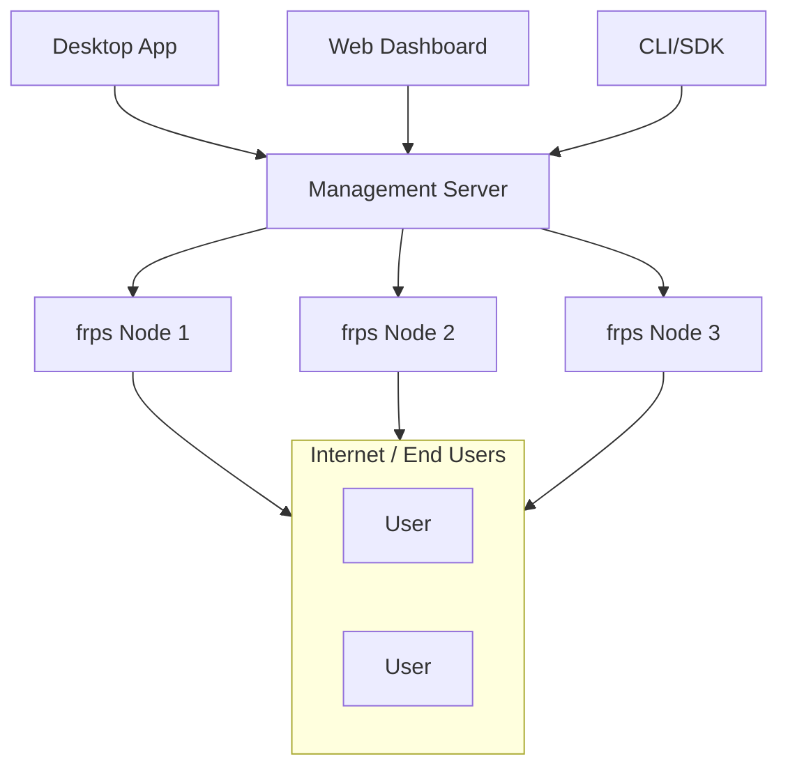

# asyou — Developer Tunnel Platform

[](https://go.dev)
[](https://react.dev)
[](https://vitejs.dev)
[](https://wails.io)
[](

**asyou** is a self-hosted tunnel management platform built on [frp](https://github.com/fatedier/frp). It allows you to expose local services (web apps, APIs, databases) to the internet through secure tunnels, with a comprehensive management layer for authentication, monitoring, and multi-node orchestration.

## ✨ Features

- **One-Click Expose** — Expose any local service with a single command or click
- **Web Dashboard** — React + Vite management UI with real-time traffic charts
- **CLI Tool** — `asyou` command-line tool for scripting and CI/CD
- **Desktop App** — Wails-based desktop client with port discovery and system tray
- **Multi-Protocol** — TCP, HTTP, HTTPS, UDP tunnel support
- **Multi-Node Cluster** — Orchestrate multiple frps instances across regions
- **Smart Scheduling** — Auto-select best node by weight, geo-proximity, capacity, latency
- **Multi-Tenancy** — User roles (`user` / `admin`) with tenant isolation
- **Real-Time Updates** — Server-Sent Events (SSE) push for live status and traffic
- **ACME Certificates** — Automated TLS certificate provisioning via Let's Encrypt
- **Auto-Download frpc** — Web dashboard generates run scripts that download frpc automatically
- **API & SDKs** — REST API + Go / Python / Node.js SDKs
- **Prometheus Metrics** — `/api/v1/metrics` endpoint for monitoring

## 🏗️ Architecture



| Component | Description |
|-----------|-------------|
| `server/` | Management API (JWT auth, multi-tenancy, SSE, geo-scheduler) |
| `web/` | React + Vite + Recharts Dashboard |
| `desktop/` | Wails desktop app (embedded frpc, port discovery) |
| `cli/` | Go CLI (`login`, `expose`, `list`, `delete`, `nodes`) |
| `sdk/` | Go / Python / Node.js SDKs |
| `core/` | frpc/frps lifecycle management, config generation, metrics |

## 🚀 Quick Start

```bash
# 1. Get frp binaries
VER="0.69.1"
cd /tmp
curl -sL "https://github.com/fatedier/frp/releases/download/v${VER}/frp_${VER}_linux_amd64.tar.gz" -o frp.tar.gz
tar xzf frp.tar.gz
cp frp_${VER}_linux_amd64/frps /tmp/frps
cp frp_${VER}_linux_amd64/frpc /tmp/frpc
chmod +x /tmp/frps /tmp/frpc

# 2. Start frps
/tmp/frps -p 7000 &

# 3. Start asyou server
cd server && go build -o /tmp/asyou-server ./cmd/server
/tmp/asyou-server &

# 4. Register & login
curl -X POST http://localhost:8080/api/v1/auth/register \
  -H "Content-Type: application/json" \
  -d '{"email":"me@example.com","password":"pass","display_name":"Me"}'

LOGIN=$(curl -s -X POST http://localhost:8080/api/v1/auth/login \
  -H "Content-Type: application/json" \
  -d '{"email":"me@example.com","password":"pass"}')
TOKEN=$(echo "$LOGIN" | python3 -c "import sys,json; print(json.load(sys.stdin)['access_token'])")

# 5. Register node
curl -X POST http://localhost:8080/api/v1/nodes \
  -H "Authorization: Bearer $TOKEN" \
  -H "Content-Type: application/json" \
  -d '{"name":"local","host":"127.0.0.1","bind_port":7000}'

# 6. Expose a service via CLI
cd cli && go build -o /tmp/asyou .
/tmp/asyou login me@example.com pass
/tmp/asyou expose 3000 --n my-app

# Your service on port 3000 is now publicly accessible!
```

## 📁 Project Structure

```
asyou/
├── server/           # Management server (Go)
│   ├── cmd/          # Entry point
│   ├── internal/     # Handlers, middleware, models, frp manager
│   └── migrations/   # SQLite schema
├── web/              # React Dashboard (Vite + TypeScript)
│   └── src/
│       ├── api/      # REST client
│       ├── components/ # UI pages & charts
│       └── hooks/    # useAuth, useSSE
├── desktop/          # Wails desktop app
│   ├── frontend/     # React frontend (embedded)
│   └── app.go        # Go backend
├── cli/              # CLI tool (Go)
├── sdk/              # Multi-language SDKs
│   ├── go/
│   ├── python/
│   └── node/
├── core/             # frpc/frps management
│   ├── frpc/         # frpc lifecycle, config, metrics
│   └── frps/         # frps lifecycle, config generation, admin client
├── docs/             # Documentation
│   ├── DESIGN.md     # Architecture & design
│   ├── USER_GUIDE.md # Full user guide (English)
│   ├── USER_GUIDE_ZH.md # Full user guide (中文)
│   ├── DEPLOY.md     # Public server deployment
│   └── PLAN.md       # Development roadmap
└── api/              # OpenAPI specification
```

## 📖 Documentation

| Document | Description |
|----------|-------------|
| [USER_GUIDE.md](./docs/USER_GUIDE.md) | Full user guide (English) |
| [USER_GUIDE_ZH.md](./docs/USER_GUIDE_ZH.md) | 完整用户指南（中文） |
| [DEPLOY.md](./docs/DEPLOY.md) | Public server deployment guide |
| [DESIGN.md](./docs/DESIGN.md) | Architecture & design decisions |
| [PLAN.md](./docs/PLAN.md) | Development roadmap & milestones |

## 🔧 Build from Source

```bash
# Server
cd server && go build -o /tmp/asyou-server ./cmd/server

# CLI
cd cli && go build -o /tmp/asyou .

# Web Dashboard
cd web && npm install && npm run build

# Desktop App (requires Wails)
cd desktop && wails build
```

## 🌐 Web Dashboard

```bash
cd web && npm run dev
# → http://localhost:5173
```

Login, create tunnels, monitor traffic, manage nodes & API keys — all from your browser.

## 🖥️ Desktop App

```bash
cd desktop && wails build
./build/bin/asyou-desktop
```

Features: one-click tunnel, port discovery, system tray, auto-login.

## 📦 SDK Examples

**Go:**
```go
client := asyou.NewClient("http://localhost:8080")
client.Login("me@example.com", "password")
proxy, _ := client.CreateProxy("my-app", "tcp", 3000, 0)
client.ProxyAction(proxy.ID, "start")
```

**Python:**
```python
client = Client("http://localhost:8080")
client.login("me@example.com", "password")
proxy = client.expose(3000, name="my-app")
```

**Node.js:**
```typescript
const client = new Client('http://localhost:8080')
await client.login('me@example.com', 'password')
const proxy = await client.expose(3000, 'my-app')
```

## 📄 License

- **Own modules** (server, web, cli, sdk, desktop, docs, core): Apache-2.0
- **frp components** (derived from [fatedier/frp](https://github.com/fatedier/frp)): Apache-2.0

See the `LICENSE` file for details.

