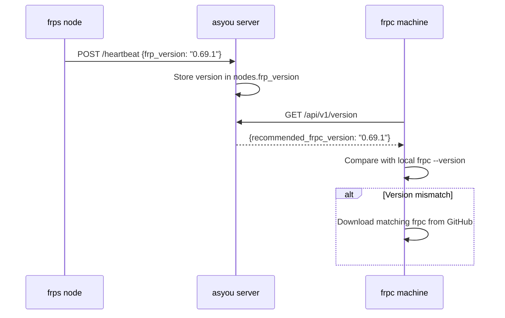

# asyou — Design Document

**Version:** v0.1  
**Last updated:** 2026-06-16

---

## 1. Overview

asyou is an open-source developer tunnel platform built on top of [frp](https://github.com/fatedier/frp) (Apache-2.0). It provides a management layer — REST API, Web Dashboard, Desktop Client, CLI, and multi-language SDKs — that controls frp's `frpc` and `frps` processes to create, manage, and monitor network tunnels.

### 1.1 Core Value

- **Self-hosted** — Full control over your tunnel infrastructure
- **Developer-first** — API-first design with SDKs in Go, Python, TypeScript
- **Multi-platform** — Web UI, Desktop (Wails), CLI, SDKs

### 1.2 Architecture

```
                    ┌──────────────────────────────────────┐
                    │          asyou Management Server     │
                    │  ┌────────┐  ┌────────┐  ┌────────┐  │
  Web Dashboard ◄───┤  │ Auth   │  │ Proxy  │  │ Node   │  │
  Desktop App   ◄───┤  │ JWT    │  │ CRUD   │  │ Geo    │  │
  CLI/SDK       ◄───┤  │ ApiKey │  │ Action │  │ Health │  │
                    │  └────────┘  └───┬────┘  └───┬────┘  │
                    │         ┌────────┴───────┐   │       │
                    │         │  frp.Manager   │   │       │
                    │         │  (frpc process)│   │       │
                    │         └───────┬────────┘   │       │
                    │         ┌───────┴────────┐   │       │
                    │         │  SSE Hub        │  │       │
                    │         │  (real-time)    │  │       │
                    │         └───────┬────────┘   │       │
                    │         ┌───────┴────────┐   │       │
                    │         │  ACME Service  │   │       │
                    │         │  (TLS certs)   │   │       │
                    │         └────────────────┘   │       │
                    └──────────────────────────────┘       │
                              │                            │
                    ┌─────────▼──────────┐    ┌────────────▼────┐
                    │  frps node         │    │  frpc           │
                    │  (port 7000)       │◄───│  (managed proc) │
                    └────────────────────┘    └─────────────────┘
```

---

## 2. Component Architecture

### 2.1 Directory Structure

```
asyou/
├── core/                   # Enhanced frp wrapper (Go library)
│   ├── frpc/               # frpc process lifecycle + config builder
│   └── frps/               # frps process + admin REST client
├── server/                  # Management server (Go)
│   ├── cmd/server/         # Entrypoint + route registration
│   └── internal/
│       ├── handlers/       # HTTP handlers (auth, proxy, node, cert, etc.)
│       ├── model/          # Domain models (User, Node, Proxy, etc.)
│       ├── frp/            # Adapter wrapping core/frpc
│       └── db/             # SQLite migration runner
├── web/                    # React Dashboard (Vite + TypeScript)
├── desktop/                # Wails desktop client (Go + React)
├── cli/                    # Command-line tool (Go)
├── sdk/                    # Multi-language SDKs
│   ├── go/                 # Go SDK
│   ├── python/             # Python SDK
│   └── node/               # Node.js/TypeScript SDK
├── server/internal/db/migrations/   # SQLite migration files (embedded)
│   ├── 0001_init.sql
│   ├── 0003_certs.sql
│   └── 0004_node_geo.sql
├── api/                    # OpenAPI specification
│   └── openapi.yaml
└── docs/                   # Documentation
    ├── PLAN.md             # Project roadmap
    ├── PHASE1.md           # Phase 1 design
    ├── DESIGN.md           # This file
    ├── USER_GUIDE.md       # User documentation
    └── demo.md             # Demo walkthrough
```

### 2.2 Technology Stack

| Layer | Technology | Rationale |
|---|---|---|
| Backend | Go 1.20+ | Performance, single binary, cross-compilation |
| Database | SQLite (via `mattn/go-sqlite3`) | Zero configuration, embedded |
| Auth | JWT (`golang-jwt/jwt/v5`) + bcrypt | Stateless, no session store |
| API | `net/http` (stdlib) | Zero framework dependency, full control |
| Frontend | React 18 + Vite + TypeScript | Modern tooling, fast dev experience |
| Desktop | Wails v2 (Go + React) | Native performance, small binary |
| CLI | Go (stdlib `flag`) | Single binary, no runtime deps |
| Real-time | Server-Sent Events (SSE) | Zero deps, unidirectional push |
| Tunnel | frp v0.69.1 | Mature, Apache-2.0 license |

---

## 3. Data Model

### 3.1 Entity Relationships

```
User (1) ────< Proxy (N) ────> (N) Node
  │                              │
  ├──< ApiKey (N)                ├── region/country/city (geo)
  │                              ├── max_connections
  └── role: admin | user         └── weight (scheduling)

Proxy (1) ────< ProxyStats (N)
Proxy (1) ────< Certificate (N)
Node  (1) ────< NodeHealth (N)
```

### 3.2 Core Models

**User** — Platform identity
```go
type User struct {
    ID           int64
    Email        string    // unique
    PasswordHash string    // bcrypt
    DisplayName  string
    Role         string    // "admin" | "user"
    CreatedAt    time.Time
    UpdatedAt    time.Time
}
```

**Node** — frps server instance
```go
type Node struct {
    ID             int64
    Name           string   // unique
    Host           string   // IP or domain
    ApiPort        int      // frps admin API port
    BindPort       int      // frp tunnel port
    TlsEnabled     bool
    AuthToken      string   // frp auth token
    Region         string   // geo: "us-west", "ap-northeast"
    Country        string   // geo: "US", "JP"
    City           string   // geo: "Tokyo"
    Latitude       float64  // geo: 35.6762
    Longitude      float64  // geo: 139.6503
    MaxConnections int      // capacity limit
    Weight         float64  // scheduling weight multiplier
    IsActive       bool     // manually deactivated
    Score          float64  // computed by scheduler (not persisted)
    LastHeartbeat  time.Time
    CreatedAt      time.Time
    UpdatedAt      time.Time
}
```

**Proxy** — Network tunnel
```go
type Proxy struct {
    ID               int64
    UserID           int64
    NodeID           *int64
    Name             string   // unique per user
    Type             string   // tcp, http, https, udp, stcp, xtcp
    LocalIP          string   // default: 127.0.0.1
    LocalPort        int
    RemotePort       *int     // assigned by frps
    Subdomain        *string
    CustomDomains    *string  // JSON array
    HostHeaderRewrite *string
    HttpUser         *string
    HttpPass         *string
    EnableTls        bool
    Status           string   // "stopped" | "running"
    Annotations      *string  // JSON error info
    CreatedAt        time.Time
    UpdatedAt        time.Time
}
```

**Certificate** — ACME-provisioned TLS cert
```go
type Certificate struct {
    ID        int64
    UserID    int64
    ProxyID   int64
    Domain    string
    CertPEM   string
    KeyPEM    string
    Issuer    string    // "letsencrypt"
    ExpiresAt time.Time
    AutoRenew bool
    CreatedAt time.Time
    UpdatedAt time.Time
}
```

---

## 4. API Design

### 4.1 Authentication

- **JWT Bearer**: `Authorization: Bearer <token>` (24h expiry)
- **API Key**: `X-Api-Key: <key>` (persistent, bcrypt-verified)
- **SSE Token**: Query param `?token=<jwt>` for EventSource connections

All endpoints under `/api/v1/proxies`, `/api/v1/nodes`, `/api/v1/certs`, `/api/v1/audit-logs`, `/api/v1/api-keys` require authentication.

### 4.2 Endpoints Summary

| Method | Path | Description | Auth |
|---|---|---|---|
| POST | `/auth/register` | Create account | — |
| POST | `/auth/login` | Get JWT | — |
| GET | `/users/me` | Current user info | JWT/ApiKey |
| GET/POST | `/nodes` | List/Create nodes | JWT/ApiKey |
| GET/PUT/DELETE | `/nodes/{id}` | Node CRUD | JWT (item handler) |
| POST | `/nodes/{id}/heartbeat` | Node health report | Node token |
| GET | `/nodes/best` | Best node for scheduling | JWT/ApiKey |
| POST | `/nodes/{id}/proxies/{pid}/stats` | Ingest proxy stats | Node token |
| GET/POST | `/proxies` | List/Create tunnels | JWT/ApiKey |
| GET/PUT/DELETE | `/proxies/{id}` | Tunnel CRUD | JWT/ApiKey |
| POST | `/proxies/{id}/action` | Start/Stop/Reload | JWT/ApiKey |
| GET/POST | `/proxies/{id}/stats` | Tunnel statistics | JWT/ApiKey |
| GET | `/audit-logs` | Audit trail | JWT/ApiKey |
| GET/POST | `/api-keys` | API key management | JWT/ApiKey |
| DELETE | `/api-keys/{id}` | Revoke API key | JWT/ApiKey |
| GET | `/certs` | List certificates | JWT/ApiKey |
| GET/DELETE | `/certs/{id}` | Certificate detail | JWT/ApiKey |
| POST | `/certs/provision` | Request TLS cert via ACME | JWT/ApiKey |
| GET | `/events` | SSE real-time stream | JWT (query) |
| GET | `/metrics` | Prometheus metrics | — |
| GET | `/version` | Server & frp version info | — |

### 4.3 Error Format

All errors follow a consistent JSON structure:
```json
{
  "error": "human-readable message",
  "code": "ERR_CODE"
}
```

Standard error codes:
| Code | Meaning |
|---|---|
| `BAD_REQUEST` | Invalid input |
| `UNAUTHORIZED` | Missing/invalid auth |
| `NOT_FOUND` | Resource not found |
| `INTERNAL` | Server error |
| `METHOD_NOT_ALLOWED` | Wrong HTTP method |
| `FORBIDDEN` | Permission denied |
| `ACME_ERROR` | Certificate provisioning failure |

### 4.4 Real-time Events (SSE)

Endpoint: `GET /api/v1/events?token=<jwt>`

Event types:
```json
// Proxy status change
{ "type": "proxy_update", "data": { "id": 1, "status": "running", "timestamp": "..." } }

// Traffic stats aggregate (every 10s)
{ "type": "stats_update", "data": [{ "proxy_id": 1, "bytes_in": 1024, "bytes_out": 512, "conn_count": 3 }] }

// Connection confirmation
{ "type": "connected", "data": { "user_id": 1 } }
```

---

## 5. Global Node Scheduling

### 5.1 Algorithm

The `NodeScorer` selects the best frps node based on multiple weighted factors:

```
Score = Base(50) + Activity(±50) + Capacity(±40) + Latency(±30) + Geo(±70) + RegionMatch(+15)
Final = Score × Weight(multiplier)
```

| Factor | Range | Details |
|---|---|---|
| **Activity** | -40 ~ +50 | Inactive: -40, Stale heartbeat: -30, Active: +50 |
| **Capacity** | -30 ~ +10 | Utilization >90%: -30, >70%: -10, <70%: bonus |
| **Latency** | -15 ~ +15 | <50ms: +15, <150ms: +8, >500ms: -15 |
| **Geo-distance** | -50 ~ +20 | >max_distance: -50, <100km: +20, <500km: +12 |
| **Region match** | 0 ~ +15 | Exact match with preferred region: +15 |
| **Weight** | ×0~∞ | Admin-configured multiplier |

### 5.2 Usage

```
GET /api/v1/nodes/best?region=ap-northeast&lat=35.68&lng=139.65&max_distance=5000
```

---

## 6. FRP Integration

### 6.1 Process Lifecycle

```
User Action           Server                    Filesystem
───────────           ──────                    ─────────
POST /action/start
    │                    │
    ▼                    ▼
  ProxyAction ──► frp.Manager.Start()
                       │
                       ├── buildFrpcConfig() ──► /tmp/asyou-proxy-{id}-*.ini
                       │
                       ├── exec.Command(frpc, -c, path)
                       │
                       └── cmd.Start() ──► frpc process (background)
                                            │
                                            └── cmd.Wait() (goroutine)
                                                  │
                                                  ├── on exit: delete process map
                                                  └── on error: capture stderr
```

### 6.2 Config Generation

The `buildFrpcConfig` function generates TOML-style INI:

```ini
[common]
server_addr = 127.0.0.1
server_port = 7000
token = my-secret

[proxy_1]
type = tcp
local_ip = 127.0.0.1
local_port = 8802
remote_port = 7001
```

### 6.3 Binary Discovery

`findFrpc()` searches in order:
1. `frpc` (PATH)
2. `/usr/local/bin/frpc`
3. `/usr/bin/frpc`
4. `/tmp/frpc`
5. `./frpc` (current directory)

### 6.4 Version Management

To ensure frpc (client) and frps (server) versions are compatible:

1. **frps reports version** via heartbeat: `POST /nodes/{id}/heartbeat { "frp_version": "0.69.1" }`
2. **Server records version** in `nodes.frp_version` column
3. **Version API**: `GET /api/v1/version` returns:
   - `recommended_frpc_version` — version from the most recently active node
   - `nodes_by_version` — count of nodes per version
   - `min_compatible_version` — minimum supported version
4. **CLI check**: `asyou check` compares local frpc version with server recommendation
5. **Sync script**: Users can run a script to auto-download the matching frpc version



---

## 7. ACME Certificate Provisioning

### 7.1 Flow

```
POST /api/v1/certs/provision
  { "proxy_id": 1, "domain": "example.com" }
  │
  ├── 1. Verify proxy ownership
  ├── 2. ACME HTTP-01 challenge
  │      ├── Register account (Let's Encrypt)
  │      ├── Request authorization for domain
  │      ├── Accept http-01 challenge
  │      └── Wait for authorization
  ├── 3. Create CSR & finalize order
  ├── 4. Store cert + key in certificates table
  ├── 5. Set proxy.enable_tls = 1
  └── 6. Return { domain, expires_at, issuer }
```

### 7.2 Requirements

- Server must be publicly reachable on port 80 for HTTP-01
- Domain must DNS-resolve to the server's IP
- Uses `golang.org/x/crypto/acme` (stdlib extension)

---

## 8. Security

### 8.1 Authentication & Authorization

- **Passwords**: bcrypt with default cost
- **JWT**: HMAC-SHA256, 24h expiry
- **API Keys**: Random 256-bit tokens, bcrypt-stored
- **Multi-tenancy**: All queries scoped by `user_id` (admin sees all)
- **Node Auth**: Node token validated via `X-Node-Token` or `Bearer`

### 8.2 Audit Trail

All mutating actions are recorded in `audit_logs`:
- Actor user ID, action type, resource type, resource ID
- Client IP address, timestamp
- Detailed context as JSON string

---

## 9. Deployment

### 9.1 Minimal Setup (Single Server)

```bash
# 1. Build
cd server && go build -o /tmp/asyou-server ./cmd/server

# 2. Start frps
/tmp/frps &

# 3. Start asyou server
/tmp/asyou-server &

# 4. Register + create node + expose
/tmp/asyou login admin@example.com password
curl -X POST http://localhost:8080/api/v1/nodes -H "Bearer $TOKEN" \
  -d '{"name":"default","host":"127.0.0.1","bind_port":7000}'
/tmp/asyou expose 3000
```

### 9.2 Global Deployment

```
                   ┌──────────────────┐
                   │  asyou Server    │
                   │  (central)       │
                   └────────┬─────────┘
                            │
          ┌─────────────────┼─────────────────┐
          │                 │                 │
   ┌──────▼──────┐  ┌──────▼──────┐  ┌──────▼──────┐
   │ frps node   │  │ frps node   │  │ frps node   │
   │ us-west     │  │ ap-northeast│  │ eu-west     │
   │ (weight 1.0)│  │ (weight 1.2)│  │ (weight 1.0)│
   └─────────────┘  └─────────────┘  └─────────────┘
```

Nodes register with the central asyou server. The scheduler assigns tunnels to the best node based on health, geography, and capacity.

---

## 10. Development

### 10.1 Prerequisites

- Go 1.20+
- Node.js 18+
- Wails CLI (`go install github.com/wailsapp/wails/v2/cmd/wails@latest`)
- frp binaries (`/tmp/frps`, `/tmp/frpc`)

### 10.2 Build Commands

```bash
# Server
cd server && go build -o /tmp/asyou-server ./cmd/server

# CLI
cd cli && go build -o /tmp/asyou .

# Web Dashboard
cd web && npm install && npm run dev

# Desktop App
cd desktop && wails dev

# SDK - Go
cd sdk/go && go build ./...

# SDK - Python
cd sdk/python && pip install -e .

# SDK - Node
cd sdk/node && npm install && npm run build
```

### 10.3 Test

```bash
cd server && go test ./...
cd core && go test ./...
```

### 10.4 Database Migrations

Migrations are embedded in the binary via `//go:embed`. The server runs them automatically on startup.

New migration: create `server/internal/db/migrations/XXXX_description.sql` — they execute in alphabetical order.

---

## 11. License

- **frp-derived code** (core/): Apache-2.0
- **Original code** (server/, web/, cli/, sdk/, desktop/): Apache-2.0
