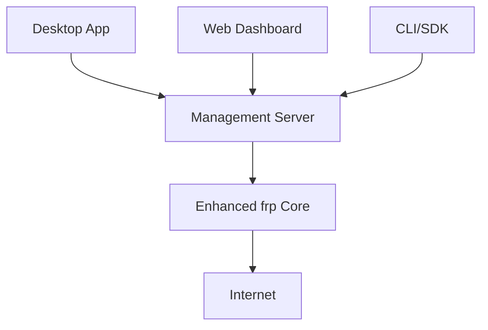

# asyou — Overall Implementation Plan

**Version:** v0.1

This document is the master plan for the `asyou` project, covering the architecture overview, repository directory structure, phased implementation plan, and key milestones to facilitate team collaboration and subsequent development.

## 1. Project Vision

Build an open-source tunnel management ecosystem for developers, based on `frp` (Apache-2.0).  
Make your local services instantly accessible from anywhere in the world! asyou is a globally distributed reverse proxy that can securely protect and accelerate your applications and network services, supporting site connections, developer previews, webhook testing, and more — solving the pain points of developer network access. Our goal is to provide:

- An easy-to-use Web management panel
- A lightweight desktop client (Wails)
- A clean CLI and multi-language SDKs
- Optional SaaS capabilities (long-term)

**Project positioning**: Developer-first, open-source, self-hostable.

## 2. Core Value & Differentiation

- Full form-factor coverage (Web + Desktop + CLI + SDK)
- Enhanced frp-based Core (supports REST API, metrics, plugins)
- Lightweight desktop client (smaller and faster than Electron)
- Well-documented, programmable SDK for easy integration

## 3. Overall Architecture

- `core`: Enhanced frp, including `frps`/`frpc` extensions, providing REST API and metrics collection
- `server`: Management server, handling users, tunnel lifecycle, multi-tenancy, and auditing
- `web`: React Dashboard (reused as a component library for the desktop app)
- `desktop`: Wails desktop client, embedding frpc for one-click tunnel experience
- `cli`: Command-line tool for scripting and CI scenarios
- `sdk`: Go/Python/Node SDK for easy access to the management API

See the diagram below:



## 4. Repository Structure (Monorepo)

```
asyou/
├── core/                    # Enhanced frp (fork)
├── server/                  # Management server
├── web/                     # Frontend (component library + Dashboard)
├── desktop/                 # Wails desktop app
├── cli/                     # CLI tool
├── sdk/                     # Multi-language SDKs
├── api/                     # OpenAPI specification
├── server/internal/db/migrations/   # Database migrations (embedded)
├── docs/                    # Documentation
├── deploy/                  # Docker/K8s configs
└── README.md
```

## 5. Phased Implementation Plan (Milestones)

### MVP Phase (Phase 0, ~2 weeks)
- **Goal**: Minimum demonstrable system
- **Tasks**:
  - Initialize Monorepo
  - Add Phase 1 docs, OpenAPI draft, initial migrations & models (completed)
  - Simple demo: manually demonstrate tunnel exposure with frps + frpc locally

### Phase 1: Enhanced Core + Management API (4–6 weeks)
- **Goal**: Implement a programmable management API with basic persistence
- **Key tasks**:
  - Fork frp, create `core/` module
  - Extend frps REST API (OpenAPI)
  - Management server `server/`: User, Node, Proxy, ApiKey, Audit
  - DB migrations and data model implementation (SQLite)
  - Metrics collection and `/metrics` endpoint
- **Acceptance criteria**: Able to create/start/stop a proxy and query its status via the API

### Phase 2: Web Dashboard (3–4 weeks)
- **Goal**: Visual tunnel management, user-friendly
- **Key tasks**:
  - Dashboard UI (login, tunnel wizard, list, detail)
  - Real-time status and traffic charts (SSE/WebSocket)
  - Node management, user permissions
- **Acceptance criteria**: Non-technical users can complete one-click expose and access via the UI

### Phase 3: Desktop Client (3–4 weeks)
- **Goal**: Wails desktop app, system tray, auto-discover local services
- **Key tasks**:
  - Embed frpc, system tray operations
  - Auto-discover local listening ports
  - One-click tunnel creation
- **Acceptance criteria**: Desktop users can create a tunnel and access the public URL with a single click

### Phase 4: CLI & SDK (2–3 weeks)
- **Goal**: Scriptable access and third-party integration
- **Key tasks**:
  - `asyou` CLI (login/expose/list/delete)
  - Release Go/Python/Node SDKs
- **Acceptance criteria**: SDK can create a tunnel in one line in a sample script

### Phase 5: SaaS & Extensions
- Multi-tenancy, global node scheduling, automatic certificate management
- Long-term goal, subject to community feedback and requirements

## 6. Development Process & Tooling Recommendations

- **Version management**: GitHub Monorepo
- **CI**: GitHub Actions (Go lint/test/build, Node lint/build)
- **Issues & Milestones**: Managed by phase
- **DB migrations**: `golang-migrate` or `goose`
- **API mock / SDK generation**: Based on `api/openapi.yaml` using OpenAPI Generator

## 7. Milestones & Deliverables

| Milestone | Phase | Estimated Time |
|-----------|-------|---------------|
| M1 | MVP (docs + simple demo) | Hours |
| M2 | Phase 1 (API + DB + core) | 4–6 weeks |
| M3 | Phase 2 (Dashboard) | 3–4 weeks |
| M4 | Phase 3 (Desktop) | 3–4 weeks |
| M5 | Phase 4 (CLI/SDK) | 2–3 weeks |

## 8. Risks & Mitigations

| Risk | Mitigation |
|------|-----------|
| **frp license & compliance** | Comply with Apache-2.0, keep sources and LICENSE  |
| **Performance & scalability** | Start with SQLite, migrate to PostgreSQL later; use Prometheus for key metrics |
| **Security** | Encrypt secrets at rest, API rate limiting, audit logging, JWT expiry & refresh |

## 9. Next Steps (Immediate)

- Generate a complete `api/openapi.yaml` (covering users, auth, nodes, proxies, metrics)
- Generate the `server` bootstrap template: `go.mod`, `cmd/server/main.go`, simple user register/login with JWT

---

**File location**: `docs/PLAN.md`